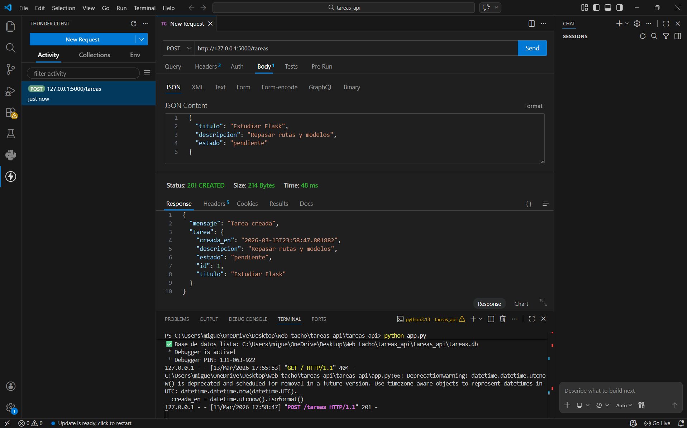
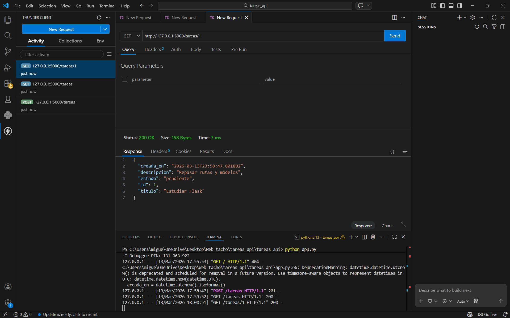
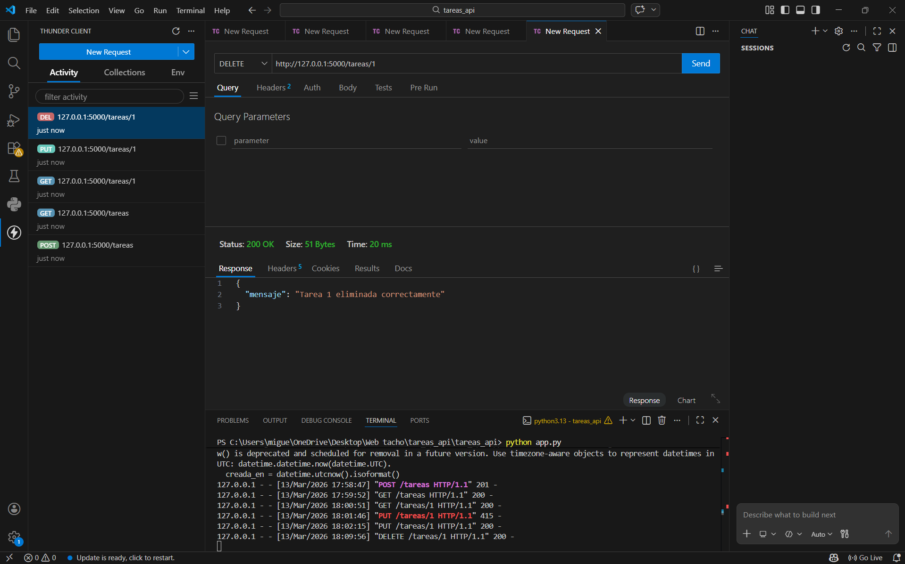

# 📝 API REST – Administrador de Tareas Personales

> CRUD completo desarrollado con **Python + Flask + SQLite** como ejercicio de implementación de servicios REST.

---

## 📸 Evidencias

### 1. POST /tareas – Crear tarea
<!-- Pega aquí tu captura de pantalla -->


### 2. GET /tareas – Listar todas las tareas
<!-- Pega aquí tu captura de pantalla -->


### 3. GET /tareas/\<id\> – Consultar tarea por ID
<!-- Pega aquí tu captura de pantalla -->


### 4. PUT /tareas/\<id\> – Actualizar tarea
<!-- Pega aquí tu captura de pantalla -->


### 5. DELETE /tareas/\<id\> – Eliminar tarea
<!-- Pega aquí tu captura de pantalla -->


---

## 📌 Descripción

Esta API permite administrar tareas personales mediante operaciones **CRUD** completas sobre una base de datos SQLite. Fue construida con el micro-framework **Flask** y el módulo `sqlite3` nativo de Python, por lo que no requiere dependencias externas adicionales.

---

## 🛠️ Tecnologías

| Tecnología | Uso |
|------------|-----|
| Python 3.x | Lenguaje principal |
| Flask | Framework web y manejo de rutas HTTP |
| SQLite3 | Base de datos relacional (nativa de Python) |
| JSON | Formato de intercambio de datos |

---

## 📂 Estructura del Proyecto

```
tareas_api/
├── app.py            ← Código principal de la API
├── requirements.txt  ← Dependencias
├── tareas.db         ← Base de datos (se genera automáticamente)
└── README.md
```

---

## 🗃️ Estructura del Recurso Tarea

Cada tarea contiene los siguientes campos:

| Campo | Tipo | Requerido | Descripción |
|-------|------|-----------|-------------|
| `id` | INTEGER | Auto | Identificador único autoincremental |
| `titulo` | TEXT | ✅ Sí | Título descriptivo de la tarea |
| `descripcion` | TEXT | ✅ Sí | Detalle o instrucciones |
| `estado` | TEXT | ✅ Sí | `pendiente` / `en_progreso` / `completada` |
| `creada_en` | TEXT (ISO) | Auto | Fecha y hora de creación en UTC |

---

## 🚀 Instalación y Ejecución

### 1. Clonar o descomprimir el proyecto

```bash
# Si lo clonaste desde GitHub
git clone https://github.com/tu-usuario/tareas_api.git
cd tareas_api
```

### 2. Instalar dependencias

```bash
pip install flask
```

### 3. Ejecutar la API

```bash
python app.py
```

La consola mostrará:

```
✅ Base de datos lista
 * Running on http://127.0.0.1:5000
```

---

## 📡 Endpoints

### `POST /tareas` — Crear tarea

**Request body:**
```json
{
  "titulo": "Estudiar Flask",
  "descripcion": "Repasar rutas y modelos",
  "estado": "pendiente"
}
```

**Response `201 Created`:**
```json
{
  "mensaje": "Tarea creada",
  "tarea": {
    "id": 1,
    "titulo": "Estudiar Flask",
    "descripcion": "Repasar rutas y modelos",
    "estado": "pendiente",
    "creada_en": "2025-10-01T12:00:00"
  }
}
```

---

### `GET /tareas` — Listar todas las tareas

```
GET http://127.0.0.1:5000/tareas
GET http://127.0.0.1:5000/tareas?estado=pendiente   ← filtro opcional
```

**Response `200 OK`:**
```json
[
  { "id": 1, "titulo": "Estudiar Flask", "estado": "pendiente", "..." : "..." },
  { "id": 2, "titulo": "Hacer ejercicio", "estado": "en_progreso", "..." : "..." }
]
```

---

### `GET /tareas/<id>` — Obtener tarea por ID

```
GET http://127.0.0.1:5000/tareas/1
```

**Response `200 OK`** — retorna el objeto de la tarea.  
**Response `404 Not Found`** si no existe:
```json
{ "error": "Tarea no encontrada" }
```

---

### `PUT /tareas/<id>` — Actualizar tarea

```
PUT http://127.0.0.1:5000/tareas/1
```

**Request body** (solo los campos a modificar):
```json
{ "estado": "completada" }
```

**Response `200 OK`:**
```json
{
  "mensaje": "Tarea actualizada",
  "tarea": { "id": 1, "estado": "completada", "..." : "..." }
}
```

---

### `DELETE /tareas/<id>` — Eliminar tarea

```
DELETE http://127.0.0.1:5000/tareas/1
```

**Response `200 OK`:**
```json
{ "mensaje": "Tarea 1 eliminada correctamente" }
```

---

## 📋 Resumen de Endpoints

| Método | Ruta | Código | Acción |
|--------|------|--------|--------|
| `POST` | `/tareas` | 201 | Crear nueva tarea |
| `GET` | `/tareas` | 200 | Listar todas las tareas |
| `GET` | `/tareas/<id>` | 200 / 404 | Obtener tarea por ID |
| `PUT` | `/tareas/<id>` | 200 / 404 | Actualizar tarea |
| `DELETE` | `/tareas/<id>` | 200 / 404 | Eliminar tarea |

---

## ⚠️ Validaciones y Errores

| Código | Situación | Mensaje |
|--------|-----------|---------|
| `201` | Creación exitosa | `"Tarea creada"` |
| `200` | Operación exitosa | `"Tarea actualizada"` / `"Tarea X eliminada"` |
| `400` | Datos inválidos o faltantes | `"El campo titulo es obligatorio"` / `"Estado invalido"` |
| `404` | Tarea no encontrada | `"Tarea no encontrada"` |

**Estados válidos:** `pendiente` · `en_progreso` · `completada`

---

## 🧪 Probar la API

Puedes usar cualquiera de estas herramientas:

- **Thunder Client** — extensión de VS Code (recomendada)
- **Postman** — aplicación independiente
- **curl** desde la terminal:

```bash
# Crear tarea
curl -X POST http://127.0.0.1:5000/tareas \
  -H "Content-Type: application/json" \
  -d "{\"titulo\": \"Mi tarea\", \"descripcion\": \"Descripcion\", \"estado\": \"pendiente\"}"

# Listar tareas
curl http://127.0.0.1:5000/tareas

# Actualizar
curl -X PUT http://127.0.0.1:5000/tareas/1 \
  -H "Content-Type: application/json" \
  -d "{\"estado\": \"completada\"}"

# Eliminar
curl -X DELETE http://127.0.0.1:5000/tareas/1
```

---

## 📚 Conclusión

Este proyecto implementa un servicio REST completo que cubre:

- ✅ **CRUD completo** sobre un recurso (Tarea)
- ✅ **Persistencia real** con base de datos SQLite
- ✅ **Validación de entradas** y respuestas HTTP correctas
- ✅ **Arquitectura REST** con rutas y métodos HTTP estándar
- ✅ **Sin dependencias innecesarias** — solo Flask y sqlite3 nativo
